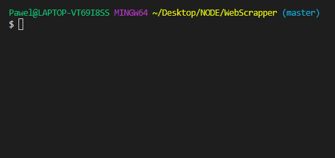

# web-scrapper-CLI :sunglasses:
This is the basic skeleton of the CLI project to scrapping websites automation web tasks.
## Getting Started
This project requires to install Node (at least ver. 8.00) on your machine. To get the latest version of Node go to this [page](https://nodejs.org/en/).
### Installation
To use web-scrapper-CLI on your local machine just type:
```
$ npm clone https://github.com/Hilver/web-scrapper-CLI.git
```
Then go to work directory and install all dependencies:
```
$ cd web-scrapper-cli
$ npm install
```
> NOTE: This project uses Puppeteer as main tool to run web tasks and it's going to download a recent version of Chromium (~170MB Mac, ~282MB Linux, ~280MB Win).

### Run CLI
After the installation is complete you can run the CLI by typing:
```
$ node cli
```
Run task example:


## Dependencies
+ [prompts](https://www.npmjs.com/package/prompts) - easy to use CLI prompts to enquire users for information...
+ [Puppeteer](https://github.com/GoogleChrome/puppeteer) - Puppeteer is a Node library which provides a high-level API to control Chrome or Chromium over the DevTools Protocol...
## Contributing
Since this project had to be an example skeleton, dedicated rather for the beginners who want to start scrapping websites or automating web tasks, I'm not going to develop it.

Unless someone will add interesting and universal ideas of tasks worth to be given as example. I'm open to implementing them :ok_hand:

Furthermore if you find any bugs or just want to help with code refactoring, help is always welcome :blush: